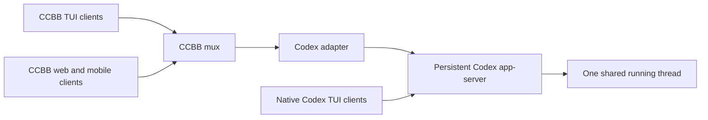

# Codex integration plan

Prepared 2026-09-11. Reviewed CCBB at `291da5c` (`main`). Worktree: `/home/sjung/src/ccbb-codex`, branch `codex`.

The goal is to give Codex the same CCBB experience as Claude Code: discover sessions, browse history and usage, start/resume/fork sessions, attach multiple terminal and browser controllers, answer prompts, and reach sessions through the existing mobile, peer, Webex, and Confluence surfaces. This document tracks the integration architecture and remaining work. CLI discovery/usage and the first desktop/mobile Codex integration are implemented (see `Done.md` and the implementation status below). The remaining parity work is tracked explicitly; this document is not a claim that every roadmap item has shipped.

**Selected architecture:** preserve CCBB's shared mux protocol and front ends, add a Codex adapter, and connect it to a persistent socket-based `codex app-server`. CCBB TUI/web/mobile clients attach through CCBB mux; native Codex TUIs connect directly to the same app-server and thread. Native-TUI coexistence was verified with the 0.154.0 compatibility probe. Keep Claude as the default for session creation; `ccbb ls` already lists both agents by default.

## Implemented web workflow (2026-09-11)

Run `node ccbb.js web -p 8610`, open `http://127.0.0.1:8610`, then choose **+ → Codex → Open**. The phone page at `/m` offers **+ Codex**. Lists show both agents; activity circles identify Codex and Claude mux sessions. Existing saved Codex sessions open as read-only history; managed sessions open the shared live renderer with a composer, streamed text/tools, approvals, questions, and usage. Unknown cost stays unknown; `~$` is a local API-price estimate, not a reported bill. The aggregate cost summary remains explicitly Claude-specific.

The default server is persistent and local: `unix://<CCBB_HOME-or-CLAUDE_CONFIG_DIR>/mux/codex/app-server.sock`. Override it with `CCBB_CODEX_ENDPOINT` to use a known existing server. The socket directory is private. CCBB never kills a shared Codex app-server when a browser closes or CCBB stops. Codex currently requires the tested 0.154.x protocol. New threads inherit Codex login, model, sandbox, and approval configuration. Claude creation preserves main’s explicit `--bin` requirement; the web dialog asks for that binary. List pushes preserve main’s opt-in watch behavior.

CLI examples:

```bash
node ccbb.js new --agent codex --detach -C /path/to/project
node ccbb.js attach <id-or-name>
node ccbb.js new --agent codex --resume <loaded-thread-id> --detach
node ccbb.js new --agent codex --resume <thread-id> --fork --detach
codex resume --remote unix:///absolute/path/to/app-server.sock <native-thread-id>
```

An in-place attach requires the thread to be loaded on the configured server. Unknown ownership is refused. A live activity icon does not imply shared control: VS Code private-stdio sessions are visible but cannot be attached through CCBB. Use the same persistent socket endpoint and native thread ID for shared native-TUI control. A fork returns a distinct thread and can copy saved history. A newly created Codex thread needs a persisted rollout before another native client can resume it. The probe waited for its first turn to finish; attaching before submitting anything returned “no rollout found” on 0.154.0.

Browser **Open session** suggests loaded thread IDs when Codex is selected. Normal messages queue within CCBB while busy; `/steer <message>` targets the active turn explicitly. `/compact` and `/model <model-id>` use Codex protocol methods. A native client can race a queued submission at a turn boundary: `turn/start` may steer an already-active server turn. Inputs are never automatically resent after an uncertain disconnect.

Browser reconnect uses mux epochs. A lost Unix-socket connection automatically reattaches only while the original socket identity remains unchanged. Saved bindings restore after a CCBB restart under the same condition. A replaced server or an unverified WebSocket lifetime requires explicit reattachment; there is also a **Reconnect Codex** button. Server-replayed pending approvals are rekeyed with the new connection generation. Codex `stop` means CCBB detachment, not thread or server shutdown.

Implemented modules: `ccbb-agent-codex.js` contains read-only stdio discovery, usage accounting, shared history normalization, and browser snapshots/cache. `ccbb-codex-session.js` contains the persistent socket transport, live control/event adapter, and attachment restoration. Existing Claude behavior stays in its current adapter boundary.

Run the consolidated regression suite with `node --test test/verify-codex.js` (25 tests). Its fake stdio server stays in `test/fake-codex-list.js`; the opt-in browser and real-account probes remain separate.

Validation:

- 25 deterministic tests cover discovery/usage, shared socket control, ownership refusal, external events, final-item reconciliation, approval/question arbitration, stale responses, detachment, socket replacement, generated browser JavaScript, and read-only HTTP/WebSocket authorization.
- Real 0.154.0 probes passed: Unix handshake (with WebSocket compression disabled), two model turns, shared-client input/events, native TUI history attachment, distinct fork, approval replay to another connection and cross-client resolution, automatic reconnection, and CCBB restart restoration.
- `test/probe-codex-control.js` is an opt-in real-account smoke probe. `test/verify-codex-web.js` uses `CHROME`, `CCBB_TEST_URL`, and `CCBB_TEST_THREAD` to test creation and desktop/mobile history using that probe's thread.
- The older `test/verify-web.js` reports nine identical failures on both this implementation and the unchanged `291da5c` baseline (stale badge/menu/mobile expectations, a text-isolation assertion, and a ResizeObserver notification). They are not reported as passing.

Remaining roadmap work: full CCBB TUI parity for complex Codex request cards, Webex/Confluence control and embed/export parity, full Codex-specific model/effort and sandbox menus, richer image/child-agent rendering, complex MCP elicitation schemas, broader external-endpoint discovery, and a verified thread-scoped shutdown operation. MCP form/URL requests have browser cards; unsupported complex forms offer decline/cancel and explain that another Codex client is required. These limitations do not prevent the implemented desktop/mobile text-and-tool workflow.

## What Claude Code already has

The implementation has two distinct paths, both relevant to parity.

| Area | Existing implementation | Codex work |
| --- | --- | --- |
| Discovery, history, stats | `ccbb-common.js`: `sessionJsonlPaths`, `getSessions`, `listSessions`, `getSessionHistoryWindow`, `computeSessionStats`, skeleton exports, cached period totals | Introduce agent-aware discovery/history/usage. Existing parsing assumes Claude JSONL records and content blocks. |
| Native terminal sessions | Common reads Claude PID sidecars, finds tmux panes, tails transcripts, injects text, and parses terminal permission dialogs | Establish Codex ownership/liveness separately; Claude sidecars and dialog patterns cannot identify Codex sessions. |
| Structured sessions | `ccbb-mux.js`: one Claude child per `Session`, bidirectional stream-json, history seeding, controls and lifecycle | Add a Codex app-server driver; retain mux snapshots, event replay and controller arbitration. |
| Terminal rendering | `ccbb-mux-tui.js` renders normalized messages, tool cards, prompts, status and usage | Add semantic Codex item rendering and agent-specific controls. |
| Browser/mobile | `ccbb-web.js`, `ccbb-mux-web.js`, `ccbb-mobile.js`: session lists, historical viewers, live mux pages, terminal UI, same-port mux routing | Agent selectors, distinct identities, capability-aware actions and shared Codex rendering. |
| Remote access | Common peer configuration and web proxy/auth routes | Carry agent identity across peers while preserving read-only versus controlling access. |
| Webex/Confluence/embed | `ccbb-webex.js`, `ccbb-confluence.js`, `ccbb-embed.js` share common helpers; bot input paths still call tmux helpers | Route history and actions through the adapter; adding a mux driver alone will not finish these integrations. |
| Hooks | `ccbb-hooks.js` installs Claude prompt-capture hooks | Keep Claude hook installation agent-specific. Structured Codex prompts should come from its driver. |
| Validation | `test/fake-claude.js`, `test/drive.js`, `test/verify.js`, `test/verify-web.js`, capture/probe scripts | Add a fake Codex protocol peer and run mixed-agent regressions. |

Important existing behavior to preserve:

- A single CCBB driver writes its agent connection and normalizes output. CCBB browsers and terminals consume CCBB events; native Codex TUIs use their own connections to the same app-server.
- Permission responses use first-answer-wins arbitration across controllers.
- Accidental controller disconnects leave the managed session running. Claude currently stops on an explicit close from its last controller; shared Codex close behavior must account for native clients that CCBB does not own.
- Reconnect uses both an epoch and sequence number; a daemon restart requires a fresh snapshot.
- Resume includes prior history, and live and historical views agree on usage.
- Mux processes must never be mistaken for native tmux sessions.

The repository contains detailed Claude mux/fidelity work in `ccbb-mux-plan.md` and `tui-fidelity.md`. Reuse its behavioral lessons and rendering components. Claude tool names, slash commands, permission modes, spinner vocabulary, cache rules and fixed context assumptions need an agent boundary.

## Codex baseline and evidence

The initial inspection used `codex-cli 0.153.4`; the installed CLI was subsequently verified as `0.154.0`, including live discovery and usage-listing smoke tests. `codex app-server --help` exposes stdio, Unix-socket and WebSocket transports, plus schema generation. I successfully generated its JSON Schema into `/tmp/ccbb-codex-schema` and inspected request, notification, thread, usage and approval definitions. This is schema verification, not a live authentication or model-turn test.

Official documentation recommends app-server for rich integrations involving history, approvals and streamed events. It also documents a native Codex terminal connecting with `--remote`; the app-server command and WebSocket transport carry experimental limitations. These warrant an explicit supported-version baseline and a compatibility probe. [Official app-server documentation](https://learn.chatgpt.com/docs/app-server)

The installed CLI accepts `--remote` on both the main TUI and `resume`, and offers local app-server daemon management. Current app-server source tracks multiple subscribed connections per thread and describes attaching to an already-running thread by returning history and atomically subscribing for updates. This supports the selected architecture, but is not a completed simultaneous-client test on the installed binary. [Thread subscriptions and running-thread resume](https://github.com/openai/codex/blob/main/codex-rs/app-server/src/thread_state.rs)

The following operation map is grounded in the locally generated 0.153.4 schema:

| CCBB operation | Codex protocol |
| --- | --- |
| Connect | `initialize` followed by `initialized` |
| Browse | `thread/list`, `thread/read`; assess paginated history methods separately |
| Start/resume/fork | `thread/start`, `thread/resume`, `thread/fork` |
| Submit/steer/interrupt | `turn/start`, `turn/steer`, `turn/interrupt` |
| Rename/compact | `thread/name/set`, `thread/compact/start` |
| Text/tools/plans/diffs | Item lifecycle and delta notifications, `turn/plan/updated`, `turn/diff/updated` |
| Approvals/questions | `item/commandExecution/requestApproval`, `item/fileChange/requestApproval`, `item/permissions/requestApproval`, `item/tool/requestUserInput` |
| Resolve pending cards | `serverRequest/resolved` |
| Models/account/usage | `model/list`, `account/read`, `account/rateLimits/read`, `thread/tokenUsage/updated` |

Do not treat online examples as the installed wire contract. Generate schemas for the supported binary, record its version, and test required methods and optional capabilities before advertising them.

## Architecture decisions

### Agent identity and shared data

Use `agent: 'claude' | 'codex'` separately from the existing billing/model `provider` concept. Claude already uses provider for Anthropic versus Bedrock; Codex also has a model-provider field.

Represent a session with `{ agent, nativeId, sessionKey, cwd, title, source, capabilities }`. Internally key maps, caches and links by a composite identity such as `codex:<nativeId>`; peer identity remains an additional namespace. Keep native thread IDs intact for protocol calls. Preserve existing bare Claude links and commands, with explicit disambiguation for mixed lists and short IDs. Update route validation and terminal-opening code, which currently assume bare session IDs.

Do not assume CCBB can choose the Codex thread ID as it chooses Claude's. Publish the final identity after thread creation succeeds; failed creation must not leave a phantom session. Keep any Codex parent/fork/session-tree metadata separate from the thread's unique identity.

Introduce small CommonJS modules, for example:

- `ccbb-agents.js`: registry, identity resolution and capability contracts.
- `ccbb-agent-claude.js`: extracted Claude discovery/history/control integration.
- `ccbb-agent-codex.js`: Codex discovery, normalized history and usage.
- `ccbb-codex-session.js`: persistent socket connection, request correlation, initialization, live control and attachment restoration. The read-only adapter owns the short-lived stdio discovery lifecycle.

These are proposed boundaries, not a requirement to rewrite the large common module at once. Start by wrapping existing Claude functions and moving only the code needed by the new interface.

### History service and asynchronous calls

Prefer Codex's history API over making its SQLite database or rollout layout CCBB's primary contract. `thread/list` needs explicit source coverage: its default interactive-source filter can omit CCBB-created app-server threads. Handle archive selection and pagination deliberately; default lists should show top-level sessions with children available from their parents.

CCBB's current common history/list functions are synchronous. Introduce an asynchronous service for agent-aware operations and update affected CLI, web and bot callers. For frequently rendered session snapshots, refresh a cache in the background and publish changes; do not block the event loop on a subprocess per row. Keep the current Claude helpers available during migration. List metadata first, load histories on demand, and bound concurrency and memory.

History reads must not resume every discovered thread. Use one normalizer for historical items and live items, keyed by stable thread/turn/item identities. Distinguish unsupported history formats from empty history. The implemented usage listing uses a versioned, read-only rollout fallback with fixture coverage; do not edit Codex's internal storage.

### Mux transport and control

Use a persistent app-server reachable through a Unix socket or a loopback WebSocket listener. CCBB may supervise a dedicated server or connect to an explicitly configured existing server; record which party owns its lifecycle. A shared server can host multiple threads. Model a managed session as one thread on that server, not as a child process that can be killed independently. This replaces the initial one-stdio-child-per-session control proposal. The existing short-lived stdio client remains suitable for read-only discovery.



For a local compatibility probe, run the server separately:

```bash
codex app-server --listen ws://127.0.0.1:4500
```

Connect the first native terminal with `codex --remote ws://127.0.0.1:4500`. Once the thread ID is known, additional terminals select that same thread:

```bash
codex resume --remote ws://127.0.0.1:4500 <thread-id>
```

The CCBB adapter connects to that same endpoint, initializes its connection, and uses `thread/resume` for the same thread ID to attach to the loaded runtime. Merely connecting to the same server does not select the same thread. Independently resuming saved history through another app-server is not attachment to the running session. These are the intended probe commands, not a claim that simultaneous native TUIs have already been validated. [Remote TUI documentation](https://learn.chatgpt.com/docs/app-server#connect-the-cli-terminal-ui)

Keep generic mux responsibilities in CCBB: its controller membership, event epochs, bounded replay, normalized snapshots, input attribution, request claims and transport authorization. Delegate Codex event decoding, history loading and control methods to the adapter. Native clients bypass CCBB arbitration, so app-server responses and events are authoritative for shared thread state. CCBB must reconcile external submissions, model changes, interrupts and resolved prompts. Avoid making Codex output impersonate raw Claude messages.

The RPC driver must correlate responses with IDs, distinguish server requests from notifications, and implement the selected transport framing: one JSON-RPC message per WebSocket text frame, including WebSocket-over-Unix connections; newline framing remains specific to stdio. Separate supervised-server stderr diagnostics, time out requests and reject outstanding promises on disconnect. Unknown notifications should be tolerated; unknown blocking requests need an explicit unsupported response or recoverable error, never silent waiting. Preserve connection generations so answers from an old connection cannot resolve a new request with a reused ID.

Serialize CCBB submissions per thread. For busy threads, expose explicit steering versus queued-next-turn behavior. Codex steering requires the expected active turn ID; handle races with native-client submissions and turn completion without duplicating input. Do not automatically resend a mutation after an uncertain disconnect. First-answer-wins inside CCBB prevents its own controllers from sending duplicate responses; verify app-server arbitration when a native client answers the same approval or question. Consume `serverRequest/resolved` to clear cards across CCBB clients and reject stale answers.

Before exposing resume, establish an endpoint-to-thread ownership contract. Attach to a known loaded thread on its owning server. Refuse in-place resume if another runtime owns the thread or ownership is unknown; permit a separate fork only through a validated workflow. Make concurrent-resume and ownership checks release gates, not deferred external-terminal work. Carry server identity and connection generation with the session binding, while keeping the native thread ID intact.

Separate controller detach, turn interrupt, thread shutdown/unload and server shutdown. Losing CCBB clients or restarting CCBB must not kill native clients' work. For shared Codex sessions, explicit client close detaches that client; do not infer permission to stop a thread from CCBB's client count reaching zero. Preserve Claude's existing explicit-last-close behavior in its driver. Gate a Codex stop action on a verified thread-scoped operation; never implement it by killing a server that may host other threads. Only shut down a CCBB-owned server when its lifecycle policy permits it, and never shut down an externally owned server. Probe what happens when every app-server client disconnects, including pending approvals and idle unloading.

On reconnect, restore the endpoint/thread binding, load history and current turn state, restore pending prompts through the supported protocol, and reconcile incoming events without duplicate messages before publishing a complete snapshot. Distinguish CCBB restart, connection loss and app-server restart. A fresh app-server must not silently be treated as the former live owner.

Keep socket access local by default. Use Unix-socket permissions or a loopback listener; for remote access use an SSH tunnel or authenticated TLS WebSockets. CCBB read-only authorization applies to its gateway, not to a native client with direct app-server access. Do not give read-only browser clients app-server credentials. The documented app-server/WebSocket experimental status remains a compatibility constraint.

### Rendering and capabilities

Extend normalized blocks for command execution, file diffs, MCP calls, plans, reasoning summaries, images and child-agent references. Preserve structured fields and render unknown items intelligibly. Only display reasoning content actually supplied by the protocol.

Expose capabilities such as `submit`, `steer`, `interrupt`, `approve`, `answerQuestion`, `rename`, `compact`, `fork`, `modelSelection` and `terminalAttach`. Gate controls on both agent support and session ownership. Keep raw Codex payloads out of browser-specific parsing.

Approval cards must show the requested action and supported decisions. Keep pending requests keyed by the server RPC request identity, not only the tool/item ID: the inspected schema allows multiple approval callbacks for one item. Apply first-answer-wins, handle resolutions/interrupts, and reject stale answers. Codex question answers are keyed by question ID with answer arrays; Claude's rewritten tool-input convention remains inside its driver.

Keep sandbox policy, approval policy and reasoning effort distinct. Inherit Codex configuration/login unless the user explicitly supplies overrides. Do not translate Claude's `acceptEdits`, `plan` or `bypassPermissions` strings directly into Codex settings. Discover models and supported effort values instead of embedding a model name in the integration.

### Usage and persistent state

Normalize input, cached input, output, reasoning output, total tokens and context-window data. The local schema contains cumulative and last-use counters, plus cache-write input tokens. Verify inclusion/overlap using fixtures and a real turn before computing totals; never add cumulative snapshots or reasoning tokens twice.

Use reported context-window information; do not carry over `contextMaxFor()`'s fixed 200k or Claude cache-TTL estimates. Render unavailable fields as unknown. Historical period totals require per-turn usage/timestamps; if the history API does not supply them, mark those totals incomplete until a validated source exists.

Keep estimated API cost separate from observed charges and subscription rate limits. Reuse pricing machinery only where the model/provider and token categories are verified. Unknown prices remain unknown, including in sort order, exports and combined totals. Forked/shared history and child-agent usage need deduplication rules so copied history is not counted as new spending.

Existing config, cache and mux state live under `CLAUDE_DIR`. Preserve that location for backward compatibility in the initial release, but centralize the CCBB state root and namespace new Codex files. Add an optional `CCBB_HOME` override without a silent migration. Honor Codex's configured home independently. Store no Codex credentials in CCBB config or frontend snapshots.

## Delivery sequence and acceptance criteria

1. **Compatibility probe and fixtures.** Record the supported Codex version/schema, capture sanitized protocol fixtures, and validate handshake, history read, one turn, approvals, questions, interrupt and resume in an isolated scratch project. Determine history-pagination support and external-session ownership behavior. Add two connections to the same socket server/thread and verify shared events, native-TUI attachment, prompt resolution and disconnect behavior. Acceptance: a repeatable protocol probe with clear unsupported-version errors and recorded results for shared-client ownership and arbitration.

2. **Extract the agent boundary with Claude preserved.** Add identity and capability contracts, wrap existing Claude behavior, and separate mux transport from controller state. Add asynchronous history-service entry points. Acceptance: existing Claude fake-driver and browser regressions still pass; existing links and default CLI commands work.

3. **Ship Codex browsing and usage.** Implement discovery, history normalization, rename, refresh, metadata, model display and honest usage fields. `ccbb ls --agent codex|claude|all` and CLI usage listing are implemented; unfiltered lists show both, while existing creation defaults to Claude. Include skeleton/stats exports and peer identity. Acceptance: mixed historical sessions render correctly, large histories remain responsive, and missing Codex/login/history support does not hide Claude sessions.

4. **Ship Codex mux control.** Add proposed `ccbb new --agent codex`, `--resume <id>` and `--fork`, retaining existing attach/stop workflows. Implement streamed items, decisions/questions, interrupt, queue/steer, model/effort controls and lifecycle recovery. Use the shared socket app-server architecture above. Acceptance: CCBB terminal/browser clients and a native Codex TUI can control the same loaded thread; approval races resolve once; reconnect snapshots include externally initiated work and pending prompts. Ownership refusal and simultaneous-resume tests must pass. Closing CCBB clients must preserve native work, and stopping one thread must not stop another thread or an externally owned server.

5. **Complete front-end parity.** Update desktop/mobile creation and filtering, tool cards, menus, usage displays, same-port routes and peer forwarding. Route Webex/Confluence actions through the same control service and adapt embed payloads. Acceptance: each surface can browse, submit, interrupt and answer supported prompts for managed Codex sessions; read-only clients cannot invoke those actions. Validate bot transports with mocks or a configured test environment.

6. **Complete external-terminal discovery and fidelity.** Build on the native `codex --remote` coexistence validated in step 4. Add endpoint discovery/configuration, daemon lifecycle guidance and native-TUI rendering comparisons. An arbitrary standalone TUI is attachable only when its owning server is identified and accessible; otherwise expose history browsing and a controlled known-idle resume/fork workflow. Terminal scraping is not the selected shared-session architecture. Acceptance: the supported native-terminal workflow is documented and tested, no duplicate runtime writes the same thread, and file activity is never mistaken for proof of a live controllable session.

7. **Package and document.** Include new modules in `package.json`'s explicit `files` list; update help, description and examples. Document the Codex version baseline, authentication prerequisites, supported front ends and external-terminal limitations. Acceptance: `npm pack --dry-run` contains the complete integration and both agents work from a clean install.

The first useful release is steps 1–4 plus desktop/mobile validation from step 5. Native-TUI coexistence is part of the first control release. The requested full parity additionally includes the remaining front ends and broader external-terminal discovery; those should remain tracked work rather than being labeled complete after the mux lands.

## Validation plan

Extend the existing discovery fixtures with a deterministic fake Codex server that implements bidirectional socket app-server RPC and multiple client connections. Cover partial JSON lines, out-of-order replies, streaming followed by final-item reconciliation, command failure, file changes, questions, repeated approvals on one item, CCBB-versus-native controller races, external submissions/settings changes, request cancellation, zero CCBB viewers with a native client attached, zero total clients, explicit close versus disconnect, reconnect, epoch changes, startup failure and server exit during a turn. Test rejected duplicate resume, unknown ownership, pending-prompt restoration, and thread stop while a second thread remains active. Cover WebSocket framing separately from the existing partial-JSON-line stdio tests.

Add history fixtures for resume/fork, compaction, child threads, source filters, archives, unsupported pagination, missing usage, unknown models and large histories. Assert mixed-agent identity isolation and correct usage deduplication, not only happy-path rendering.

Reuse `test/drive.js`, `test/verify.js` and `test/verify-web.js`. The browser scripts currently hard-code a macOS Chrome path; make the executable configurable for Linux and isolate CCBB/Claude/Codex state under temporary directories. Add checks for read-only auth, peer routing, agent-specific controls and empty/unknown cost behavior. Perform a small real-Codex smoke test after the fake protocol tests pass, then compare terminal/browser output against real Codex captures for the important item and prompt types.

Current evidence and remaining scope are recorded in “Implemented web workflow” above. The delivery sequence remains the broader parity roadmap; completed desktop/mobile work must not be mistaken for completed bot/export or arbitrary-terminal parity.

Native Codex activity on Linux is detected from writable rollout descriptors owned by Codex processes, including VS Code sessions outside CCBB’s mux. Turn lifecycle records distinguish working from idle; an old transcript alone does not establish liveness. History views remain read-only for conversation input while their activity indicators poll every three seconds. Process visibility restrictions or platforms without `/proc` prevent this native ownership fallback.

The shared mux renderer windows history to 5 head messages and 25 tail messages (10 tail messages on mobile). The middle stays in client state and is rendered on demand in chunks of 25 or all at once. Layout observers maintain the bottom position while following, including panels mounted while hidden; user scrolling up stops following. This limits rendered DOM, not the history transferred from the server.

Review notes: complete `token_usage_record` chains now supply usage/cost estimates, including compaction; a partial chain leaves cost unknown. The CCBB TUI shows Codex costs as estimates and does not run Claude subscription/status-line scripts for Codex. The native Codex TUI remains the supported route for the full native controls. `LICENSE` predates this integration and remains part of the npm package; its LobeHub MIT notice covers the embedded icon sources.

## Final review and main-worktree integration

Reviewed against main `399b1c1`, preserving its explicit Claude binary selection and opt-in list updates. Fixed the web creation form to supply the chosen Claude binary, asynchronous Codex creation merge conflicts, compaction accounting, unknown fork baselines, an early-turn-completion queue race, malformed mux message handling, and Codex TUI cost/Claude-script separation. The existing MIT LICENSE stays packaged with the LobeHub attribution.

Validation: 25 Codex regression tests pass; desktop/mobile browser checks pass for creation, persisted rename, activity, history windows, scroll following, and standalone control. `npm pack --dry-run` includes both Codex modules and LICENSE. The existing `test/verify.js` has seven failures in the reviewed tree, all also present among nine failures on untouched main: Read summary, ResizeObserver notification, command-error rendering, current/peak context display, and three seeded-history fixture checks. These are recorded limitations, not passing results. No model turns were submitted during this final review.

The implementation is the desktop/mobile/shared-session release described above, not full bot/export or arbitrary-native-session parity. See TODO.md for the remaining work.
